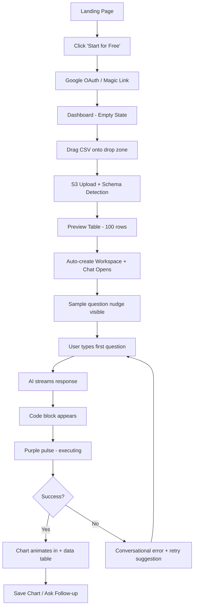
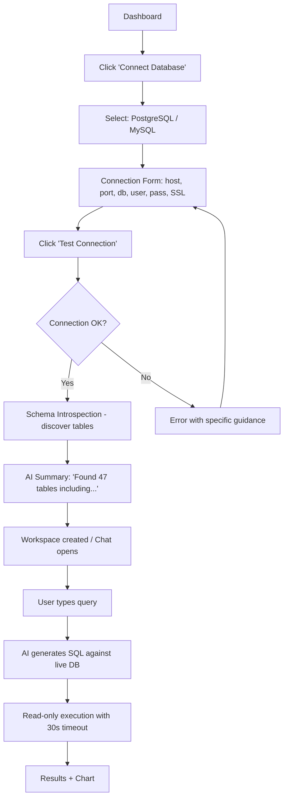
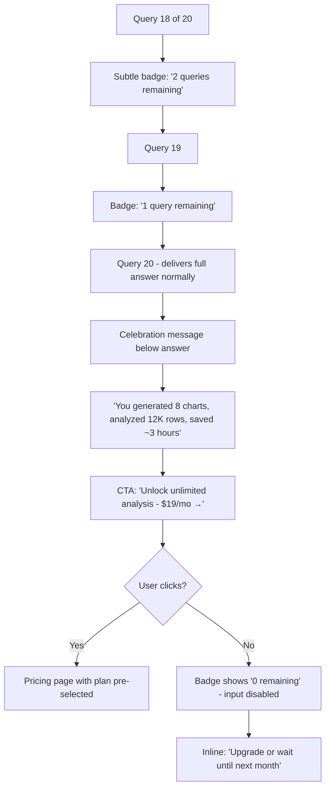

# UX Design Specification Vizo

**Author:** Wissem
**Date:** 2026-02-28

---

## Design Direction

### Theme
- **Dual mode:** Dark + Light with user toggle (default: dark)
- **Inspiration:** Julius.ai — clean, modern, approachable analytics UX
- **Style reference:** Red Noir template adapted to purple palette with softer gradients

### Color Palette
- **Accent:** Purple/Violet (primary interactive color, CTAs, highlights)
- **Dark mode:** Near-black backgrounds, subtle borders, white text
- **Light mode:** White/soft gray backgrounds, dark text, purple accents maintained
- **Semantic:** Green (success/positive data), Red (errors/negative data), Amber (warnings)

### Typography
- **Headings:** Manrope (bold, tight tracking)
- **Body:** Inter (clean, readable)
- **Code:** JetBrains Mono or Fira Code (SQL/Python blocks)

### Key UX Patterns (Julius.ai-inspired)
- Chat-first interface: conversation left, visualization right
- Drag-drop file upload as primary onboarding action
- Soft gradients, not harsh contrasts — approachable and trustworthy
- Data previews inline within chat (tables, charts, code blocks)
- Floating pill navbar with backdrop blur
- Animated CTAs with gradient borders
- Bento grid feature showcases

### Pricing Display
- All 4 tiers visible: Free / Starter ($19) / Pro ($49) / Team ($99)
- Free tier de-emphasized (outlined/subtle card), Starter/Pro/Team as solid cards
- Pro tier highlighted as "Recommended" with accent badge and slight scale-up
- Monthly/Annual toggle (annual = 2 months free)

---

## Executive Summary

### Project Vision
Vizo is an AI-powered conversational analytics platform for solo analysts. Users connect data (files or databases), ask natural-language questions, and receive instant insights with auto-generated SQL/Python code and interactive visualizations. The UX must feel approachable for non-technical analysts while giving power users full code visibility and control. Inspired by Julius.ai's clean, modern aesthetic — adapted with dual-theme support, purple accent identity, and code transparency as a first-class feature.

### Target Users
- **Non-technical analysts** (Sarah, Fatima): Excel-comfortable, no SQL/Python. Need drag-drop simplicity, visual results, zero code requirement. Emotional design priority: safety and confidence
- **Technical analysts** (Omar): SQL/Python fluent. Need speed, code editing, database connectors, multi-axis charts. UX priority: efficiency and control
- **All users**: Desktop-first (laptop/monitor), use during work hours, data-sensitive environments

### Key Design Challenges
1. **Split-screen chat + visualization layout** — conversation left, charts/tables/code right. Must work across screen sizes. Use `react-resizable-panels` with persistent ratio per workspace
2. **Onboarding without overwhelm** — Free tier limits (no code execution, no DB connectors) must feel like a starting point, not a restriction. Upgrade prompts = unlocking superpowers
3. **Code transparency for dual audiences** — `</> View Code` toggle on every AI response. Collapsed by default for non-technical users, expanded for technical. Copy + Edit & Re-run buttons
4. **Dual theme consistency** — Purple accent (`#8B5CF6`) must feel premium in both dark and light mode. Charts, syntax highlighting, and interactive elements polished in both
5. **Inline rendering complexity** — Interactive charts, editable code blocks, scrollable data tables, and natural language all coexist within chat messages

### Design Opportunities
1. **Magical first interaction** — Upload CSV → get beautiful chart in under 60 seconds. The primary conversion moment. Gentle nudge onboarding: drop zone + sample question bubble ("Try: What were my top products last month?") that disappears after first success
2. **Interactive inline visualizations** — Recharts rendered inside chat thread. Hover tooltips, responsive sizing. Differentiates from generic AI chat
3. **Purple AI "thinking" glow** — Subtle animated purple gradient when AI is processing. Distinctive brand identity, makes AI feel alive
4. **Code as a feature, not a footnote** — Code blocks build trust even for non-technical users. Education angle: analysts learn SQL/Python through transparent AI
5. **Landing page narrative arc** — Hero with animated chart materialization → data source logos strip → bento feature grid → How it Works (3 steps: Upload → Ask → Insight) → pricing → CTA matching dashboard experience

---

## Core User Experience

### Defining Experience

**The core loop:** Ask a question → get a visual answer with code.

Everything in Vizo orbits this interaction. Upload, connect, save, share — all scaffolding around the central act of *asking your data a question and getting an instant, visual, verifiable answer*.

The interaction sequence:
1. User types natural-language question in chat input
2. AI streams text response (first token <2 seconds)
3. Code block appears with generated SQL/Python (syntax-highlighted, collapsible)
4. Purple pulse animation during query execution ("Running query...")
5. Results render: data table and/or auto-selected chart animates into view
6. User can view code, edit & re-run, save chart, or ask follow-up

### Platform Strategy

| Dimension | Decision | Rationale |
|---|---|---|
| **Primary** | Web app (desktop-first) | Analysts work on laptops/monitors with data |
| **Input** | Mouse + keyboard | Chat-based, lots of typing, data table navigation |
| **Mobile** | Responsive but not optimized (MVP) | Mobile-responsive chat in Growth v1.5 |
| **Offline** | Not needed | Requires AI API + database connections |
| **Browser** | Chrome, Firefox, Safari, Edge (last 2 versions) | PRD NFR-6.3 |
| **Layout** | Split-screen: chat left, visualization right | Julius.ai-inspired, `react-resizable-panels` |
| **Panel Presets** | `Cmd+1` Chat-focused (70/30), `Cmd+2` Balanced (50/50), `Cmd+3` Visual-focused (30/70) | Power user efficiency, persist per workspace |

### Effortless Interactions

1. **File upload** — Drag CSV/Excel onto drop zone → schema detected, preview shown, workspace auto-created. Zero configuration dialogs
2. **Database connection** — Enter credentials → AI summarizes discovered schema ("I found 47 tables including user_sessions, transactions..."). No required table selection — everything included by default, optional fine-tuning in settings
3. **First question** — Type anything natural → get answer. No "select tables" or "configure schema" required
4. **Chart generation** — AI auto-selects optimal chart type based on data shape. No manual axis mapping
5. **Theme toggle** — One click, everything adapts (charts, code blocks, UI). No flash, preserves scroll position
6. **Code viewing** — Collapsed by default for non-technical users. One click to reveal, already syntax-highlighted. State persists per session

### Critical Success Moments

| Moment | What Happens | Why It's Critical |
|---|---|---|
| **First Chart** | Upload file + ask one question → chart animates into view | The "aha!" that converts free → returning user. First chart per session draws itself (bars grow, lines trace). Subsequent charts fast-render |
| **First Code Peek** | Non-technical user expands code block | Builds trust + plants learning seeds |
| **First Edit & Re-run** | Technical user modifies SQL → Re-run → updated result | Proves Vizo is a power tool, not a black box |
| **First DB Connection** | Connect PostgreSQL → AI confirms schema discovery → first query | Validates Vizo handles real production data |
| **Credit Exhaustion** | Hits quota → celebratory message quantifying accomplishments → upgrade path | Subtle countdown from query 18. No blocking modal. Celebrate before upselling: "You've generated 8 charts, analyzed 12K rows, saved 3 hours" |

### Progressive Execution States

Every AI response follows a visual state machine with no dead moments:

```
[Typing indicator] → [Text streams in] → [Code block appears with ▶ icon]
    → [Purple pulse: "Running query..."] → [Results/chart animate in]
```

- **Text streaming**: Words flow in token-by-token
- **Code ready**: SQL/Python block appears with spinning play icon
- **Executing**: Purple pulse animation on code block border. For Python: show package loading ("Loading pandas...")
- **Results**: Chart draws itself on first interaction per session; fast-renders after. Data tables fade in with row count

### Experience Principles

1. **🎯 Configuration Minimal, Not Absent** — Zero-config for files. For databases: confident AI schema summary, no required action, optional fine-tuning. Users type what they want to know; the system handles everything else
2. **👁️ Show Your Work** — Every AI response includes underlying code. `</> View Code` toggle on every response. Collapsed for simplicity, expandable for power. Copy + Edit & Re-run buttons
3. **⚡ Instant Gratification** — First token <2s. Progressive disclosure with state indicators for every phase. No loading spinners — animated transitions everywhere
4. **🟣 Purple Means AI** — Purple glow when thinking, purple pulse during execution, purple highlights on AI content. The accent color IS the AI's visual signature
5. **🔄 Your Workspace, Your Way** — Resizable panels with keyboard presets, theme choice, AI provider choice. Persist all preferences per workspace. The tool adapts to you

### UX Behaviors to Spec

| Behavior | Specification |
|---|---|
| Panel resize persistence | Save ratio per workspace in DB, survive browser refresh, handle window resize gracefully |
| Theme toggle mid-chat | All inline charts re-render in new theme colors without losing scroll position |
| Chart animations | Non-blocking — user can scroll past animating chart. First-per-session animated, then fast-render |
| Code block expand/collapse | Persist state within session. If user expands all, they stay expanded |
| Keyboard shortcuts | `Cmd+1/2/3` for panel presets. `Cmd+Enter` to send message. `Esc` to cancel streaming |

---

## Desired Emotional Response

### Primary Emotional Goals

| Emotion | Trigger | Design Approach |
|---|---|---|
| **Empowerment** — "I feel powerful" | Sarah gets a chart in 30 seconds that took an hour in Excel | Results always include actionable output (charts, data, code). Never just text |
| **Confidence** — "I can trust this" | Omar sees clean, correct SQL and edits it | Code transparency, read-only badges, execution time displayed, data provenance |
| **Belonging** — "This gets me" | Fatima's workspace remembers everything | Persistent preferences, theme, panel layout, workspace identity |

### Emotional Journey Mapping

| Stage | Emotion | How We Create It |
|---|---|---|
| **Discovery** (landing page) | *Curiosity + Aspiration* | Animated hero showing a question becoming a chart. "I could do that." |
| **Sign-up** | *Ease + Momentum* | Google OAuth in 2 clicks. No forms, no verification emails |
| **First upload** | *Safety + Excitement* | Warm drop zone, friendly copy. Schema auto-detected — feels magical |
| **First AI response** | *Delight + Wonder* | Chart draws itself, code appears, answer is spot-on. The "wow" moment |
| **Daily use** | *Competence + Flow* | Keyboard shortcuts, fast renders, persistent workspace. Tool disappears, work flows |
| **Hit a limit** | *Appreciated, not blocked* | "You've accomplished X. Unlock more →" Celebrates before upselling |
| **Error/failure** | *Supported, not blamed* | Friendly error messages: "I couldn't connect. Let's check the credentials together." Never "Error 500" |
| **Return visit** | *Comfort + Familiarity* | Everything where they left it. Like coming home |

### Emotional Escalation Chain

The path from first visit to recommendation follows a strict emotional sequence. Each emotion must be achieved before the next can occur:

1. **Curiosity** (Landing page) → "This might solve my problem"
2. **Confidence** (First upload) → "This feels safe and capable"
3. **Delight** (First chart) → "That was unexpectedly beautiful and fast"
4. **Amazement** (Cross-data insight) → "It can do things I didn't even ask for"
5. **Ownership** (Saved charts, persistent workspace) → "This is MY analytics workspace"
6. **Investment** (Upgrade) → "The value far exceeds the cost"
7. **Anticipation** (Return visit) → "I'm looking forward to using this"
8. **Evangelism** (Recommendation) → "I have to tell someone about this"

Breaking any link in the chain prevents downstream emotions from forming. UX priority: protect the weakest links (Confidence and Delight).

### Micro-Emotions

| Positive (Cultivate) | Negative (Prevent) |
|---|---|
| **Confidence** — "I know this is correct" (code transparency) | **Confusion** — "What do I do next?" (clear affordances, guided nudges) |
| **Delight** — "That was unexpectedly beautiful" (chart animations, purple glow) | **Anxiety** — "Will this break my database?" (read-only badges, safety messaging) |
| **Accomplishment** — "I just created something valuable" (save confirmations) | **Frustration** — "Why isn't this working?" (progressive error messages, retry buttons) |
| **Trust** — "I can see exactly what it did" (expandable code blocks) | **Skepticism** — "Is the AI making this up?" (show SQL, show sources, data provenance) |
| **Belonging** — "This tool is mine" (persistent preferences) | **Isolation** — "I'm stuck with no help" (contextual tips, FAQ links in errors) |

### First-Time vs. Repeat-Use Emotional Modes

The emotional design must serve two distinct usage modes:

**First-Time Mode** (first 3 sessions):
- Optimize for: Curiosity → Confidence → Delight
- Chart animations ON, guided nudges visible, sample questions shown
- Celebrate every milestone ("First chart saved! 🎉")
- Purple AI glow prominent and expressive

**Repeat-Use Mode** (session 4+):
- Optimize for: Efficiency → Flow → Professional Pride
- Chart animations OFF (instant render), nudges hidden
- No milestone celebrations — respect the workflow
- Purple AI glow subtle (just the thinking indicator)
- Keyboard shortcuts prominently documented
- Data provenance shown by default ("Source: sales_q4.csv, 15,847 rows")

**Transition:** System detects usage pattern (session count, query count) and gracefully shifts from first-time to repeat-use emotional mode. No toggle needed — adapts automatically. User can override in settings.

### Fundamental Emotional Truths

These non-negotiable truths override all other emotional design decisions:

1. **Correctness > Beauty** — A plain-looking correct answer beats a beautiful wrong one. Always show data provenance
2. **Presentability** — Charts must be screenshot-ready for presentations. No tool branding on outputs
3. **Self-verification** — Users must be able to verify AI answers independently through visible code, row counts, and source data references
4. **Visceral Security** — Security messaging should be felt, not just documented. "Your data stays in your browser" > "AES-256 encryption"
5. **Speed Compounds** — Repeat-use speed is the #1 retention driver. Optimize for the 50th query, not just the 1st

### Emotional Design Principles

1. **🌟 Celebrate Before You Sell** — When users hit limits, show what they've accomplished first. Quantify their value. Then offer the upgrade path
2. **🤝 Errors Are Conversations** — Every error is an opportunity to help. "I couldn't parse column 3 — it looks like mixed date formats. Want me to try a different parser?" Never show stack traces
3. **✨ First Impressions Are Animated, Repeat Use Is Fast** — First-time delight through animations; repeat-use efficiency through instant rendering. System adapts automatically
4. **🔒 Safety Is Visible** — Read-only badges, "Sandboxed" labels, encryption indicators. Users should SEE that their data is safe
5. **💜 Purple Is the AI's Voice** — Every AI-driven moment uses purple accent. Users learn to associate purple with "the AI is helping me." Human actions remain neutral

---

## UX Pattern Analysis & Inspiration

### Inspiring Products Analysis

#### Julius.ai — Primary Inspiration
- **Adopt:** Clean chat-first split-panel layout, instant file upload → schema detection, inline native charts, soft approachable UI, minimal onboarding
- **Improve on:** Single AI provider → our multi-provider choice. Hidden code → our transparent editable code. No chart gallery → our persistent workspace gallery. Limited DB connectors → our Starter-tier DB access

#### ChatGPT — Streaming & Conversation Benchmark
- **Adopt:** Token-by-token streaming, conversation sidebar with history, code blocks with copy button, dark mode
- **Adapt:** Model selector → our AI provider picker per workspace. General chat UI → specialized data analysis messages with inline charts

#### Vercel Dashboard — Developer-Friendly Analytics
- **Adopt:** Clean data tables with sorting, subtle non-blocking animations, status badges
- **Adapt:** Tab-based project navigation → our workspace tabs (Chat / Gallery / Sources / Settings)

#### Linear — Workflow Efficiency Master
- **Adopt:** Keyboard-first navigation, ultra-fast transitions, minimal chrome, subtle hover states
- **Adapt:** Command palette → simplified panel presets + common actions

### Transferable UX Patterns

**Navigation:**
- Workspace-scoped sidebar (conversations list, collapsible) → existing `sidebar.tsx`
- Tab bar within workspace (Chat | Gallery | Sources | Settings) → existing `tabs.tsx`
- Floating action menu (new conversation, upload, connect DB) → existing `dropdown-menu.tsx`

**Interaction:**
- Streaming message bubble with progressive rendering → new component
- Inline expandable code blocks within messages → existing `collapsible.tsx` + syntax highlighting
- Global drag-to-upload anywhere on file drag → extend existing `file-upload.tsx`
- Resizable split panels with draggable divider → existing `resizable.tsx`

**Visual:**
- Skeleton loading placeholders → existing `skeleton.tsx`
- Non-blocking toast notifications → existing `sonner.tsx`
- Progressive disclosure (show essentials, reveal on demand) → collapsible code, expandable schema

### Anti-Patterns to Avoid

| Anti-Pattern | What We Do Instead |
|---|---|
| Configuration wizards on first use | Zero-config. Upload → chat. Period |
| Modal paywalls | Inline upgrade nudges with accomplishment summary |
| Auto-playing tutorials | Gentle nudge that disappears after first success |
| Generic error messages | Conversational errors with specific guidance |
| Infinite loading spinners | Progressive states with phase indicators |
| Hiding exit/cancel | `Esc` cancels streaming. Clear close buttons everywhere |
| Dark patterns in pricing | Transparent pricing, no hidden fees, clear quota display |

### Existing Component Mapping

| Pattern Need | Indie Kit Component | Customization |
|---|---|---|
| Split panels | `resizable.tsx` | Add preset buttons + persistence |
| File upload | `file-upload.tsx` + `s3-uploader/` | Schema preview callback |
| Theme toggle | `theme-switcher.tsx` | Purple accent + chart re-color |
| Data tables | `table.tsx` | Sorting, pagination, row count |
| Sidebar | `sidebar.tsx` | Workspace/conversation tree |
| Pricing | `pricing.tsx` + `monthly-annual-pricing.tsx` | 4 tiers, purple accent |
| Charts | `chart.tsx` | AI-config driven, theme-aware |
| Forms | `form.tsx` + `input.tsx` + `select.tsx` | DB connection form |
| Toasts | `sonner.tsx` | Success/error with retry |
| Skeletons | `skeleton.tsx` | Chat + chart loading states |
| Badges | `badge.tsx` | Query status, plan tier, AI provider |
| Tabs | `tabs.tsx` | Workspace sections |
| Dialogs | `dialog.tsx` | Confirmations, settings |

### Design Inspiration Strategy

**Adopt directly:** Julius.ai chat layout, ChatGPT streaming, Vercel data tables, Linear keyboard shortcuts
**Adapt for context:** Conversation sidebar scoped to workspaces, file upload extended with DB connections, tabs for workspace sections
**Avoid:** Tableau configuration-heavy approach, Power BI desktop mental model, Jupyter code-first intimidation, generic chatbot patterns
**Build on Indie Kit:** ~70% of UI exists. New components needed: chat message bubble, code block with edit/re-run, chart renderer, schema preview, workspace manager, chart gallery

---

## Design System Foundation

### Design System Choice

**shadcn/ui + Tailwind CSS 4** — already installed and configured in Indie Kit boilerplate with 60+ components.

### Rationale

1. Already installed & working — zero setup cost
2. Components are copied into project (not node_modules) — full ownership and customization
3. Tailwind CSS variables enable single-point theme changes
4. Radix UI primitives provide WCAG AA accessibility by default
5. `chart.tsx` wraps Recharts with theme-aware colors
6. Massive ecosystem — AI tools understand shadcn patterns natively

### Customization Strategy

| Layer | Change | Location |
|---|---|---|
| Primary accent | `--primary: #8B5CF6` (violet-500) | `globals.css` |
| Typography | Manrope (headings), Inter (body), JetBrains Mono (code) | `next/font` + `tailwind.config.ts` |
| Chart palette | Purple-based color series for all chart types | `chart.tsx` config |
| Dark backgrounds | Tune surface, border, muted values for noir aesthetic | `globals.css` dark theme |
| Light backgrounds | Soft grays, white, purple accents maintained | `globals.css` light theme |
| Animation tokens | Fast (150ms), normal (300ms), expressive (500ms) | CSS custom properties |

### Implementation Approach

```
Phase 1: Theme (CSS variables, fonts, colors)
Phase 2: Extend existing (table sorting, chart theming, upload schema preview)
Phase 3: Build new composites (chat bubble, code block, chart renderer)
Phase 4: Landing page restyle (purple accent on Tailark sections)
```

---

## Defining Experience

### The Core Interaction

**"Ask a question about your data → get a visual answer with verifiable code."**

Like Tinder's "swipe to match" or Spotify's "play any song instantly" — Vizo's defining experience is a single sentence: *type a question, get a chart with the code that made it.* If this interaction feels magical, everything else follows.

### User Mental Model

| User Type | Mental Model | Expectation |
|---|---|---|
| **Sarah** (non-technical) | "It's like Google for my spreadsheets" | Type question → get answer. No code needed |
| **Omar** (technical) | "It's like a smarter SQL client with AI autocomplete" | Type question → get SQL → tweak it → re-run |
| **Fatima** (Excel power user) | "It's like having a data analyst assistant" | Upload files → ask anything → get charts she'd normally build manually |

### Success Criteria for Core Interaction

1. **"This just works"** — User types any reasonable question about their data and gets a relevant answer within 5 seconds
2. **"I feel smart"** — The chart appears and matches what the user expected. The AI understood the intent
3. **"I can trust this"** — Code is visible, row count is shown, data source is labeled
4. **"I want to ask more"** — The answer inspires a follow-up question. Conversational momentum builds

### Novel vs. Established Patterns

**Established patterns we adopt:**
- Chat interface (ChatGPT-familiar)
- File upload drag-drop (universally understood)
- Split-panel layout (VS Code, IDE-familiar)
- Code blocks with syntax highlighting (developer-familiar)

**Novel combination that makes Vizo unique:**
- Chat message that contains BOTH natural language + interactive chart + editable code — this 3-in-1 message type doesn't exist in standard chat UIs
- AI that auto-selects between SQL and Python — user never chooses, the AI decides based on question type
- Progressive execution visualization — streaming text → code appears → purple pulse → chart materializes

### Experience Mechanics

**1. Initiation:** User types in chat input at bottom of left panel. `Cmd+Enter` sends. Input supports multi-line.

**2. Interaction:** Message appears in chat thread. AI streams text response. Code block materializes with syntax highlighting. Purple pulse during execution. Chart/table animates into right panel (or inline on smaller views).

**3. Feedback:** Each phase has visual state. Streaming = text cursor. Executing = purple pulse + "Running query..." Completed = green checkmark + execution time. Error = red border + conversational error message.

**4. Completion:** Chart is interactive (hover tooltips). "Save Chart" and `</> View Code` buttons visible. Follow-up input auto-focused. Conversation scroll position maintained.

---

## Visual Design Foundation

### Color System

**Primary Palette:**

| Token | Dark Mode | Light Mode | Usage |
|---|---|---|---|
| `--primary` | `#8B5CF6` (violet-500) | `#7C3AED` (violet-600) | CTA buttons, AI highlights, active states |
| `--primary-foreground` | `#FFFFFF` | `#FFFFFF` | Text on primary |
| `--background` | `#09090B` (zinc-950) | `#FFFFFF` | Page background |
| `--foreground` | `#FAFAFA` (zinc-50) | `#09090B` (zinc-950) | Primary text |
| `--card` | `#18181B` (zinc-900) | `#FFFFFF` | Card surfaces |
| `--muted` | `#27272A` (zinc-800) | `#F4F4F5` (zinc-100) | Subtle backgrounds |
| `--border` | `#3F3F46` (zinc-700) | `#E4E4E7` (zinc-200) | Borders, dividers |
| `--accent` | `#A78BFA` (violet-400) | `#8B5CF6` (violet-500) | Hover states, secondary purple |

**Semantic Colors:**

| Token | Value | Usage |
|---|---|---|
| `--success` | `#22C55E` (green-500) | Query success, connection confirmed |
| `--destructive` | `#EF4444` (red-500) | Errors, delete actions |
| `--warning` | `#F59E0B` (amber-500) | Quota warnings, timeouts |
| `--info` | `#3B82F6` (blue-500) | Informational badges, tips |

**Chart Color Series (8 colors for data visualization):**
`#8B5CF6`, `#06B6D4`, `#F59E0B`, `#EF4444`, `#22C55E`, `#EC4899`, `#F97316`, `#6366F1`

### Typography System

| Element | Font | Weight | Size | Line Height |
|---|---|---|---|---|
| H1 (page titles) | Manrope | 700 | 2.25rem (36px) | 1.2 |
| H2 (section titles) | Manrope | 600 | 1.875rem (30px) | 1.3 |
| H3 (card titles) | Manrope | 600 | 1.25rem (20px) | 1.4 |
| Body | Inter | 400 | 0.875rem (14px) | 1.5 |
| Body small | Inter | 400 | 0.75rem (12px) | 1.5 |
| Code | JetBrains Mono | 400 | 0.8125rem (13px) | 1.6 |
| Button | Inter | 500 | 0.875rem (14px) | 1 |
| Badge | Inter | 500 | 0.75rem (12px) | 1 |

### Spacing & Layout Foundation

- **Base unit:** 4px
- **Spacing scale:** 4, 8, 12, 16, 20, 24, 32, 40, 48, 64, 80, 96
- **Content density:** Medium — spacious enough for readability, dense enough for data-heavy screens
- **Max content width:** 1440px (landing), full-width (in-app)
- **Grid:** 12-column for landing pages, flex-based for in-app layouts
- **Border radius:** `--radius: 0.5rem` (8px) for cards, `0.375rem` (6px) for inputs, `9999px` for pills/badges

### Accessibility Considerations

- All text meets WCAG AA contrast (4.5:1 for body, 3:1 for large text)
- Purple `#8B5CF6` on `#09090B` = 5.2:1 contrast ratio ✅
- Purple `#7C3AED` on `#FFFFFF` = 4.6:1 contrast ratio ✅
- Focus rings: 2px solid purple with 2px offset
- All interactive elements have visible focus states
- Keyboard navigation: Tab order follows visual order
- Screen reader: ARIA labels on all icon-only buttons

---

## Design Direction

### Chosen Direction: "Purple Noir Analytics"

A Julius.ai-inspired clean interface adapted with:
- **Dark-first** with polished light mode
- **Purple accent** as the AI's visual signature
- **Data-dense but readable** — respects analyst workflows
- **Animated first-time, fast repeat-use** — dual emotional mode

### Key Visual Decisions

| Decision | Choice | Rationale |
|---|---|---|
| Layout | Split-panel (chat left, viz right) | Julius.ai proven pattern, existing `resizable.tsx` |
| Navigation | Workspace sidebar + tab bar | Combines ChatGPT sidebar with Vercel tabs |
| Cards | Subtle borders, no shadows in dark mode; light shadows in light mode | Clean, non-distracting |
| Buttons | Solid purple for primary, ghost for secondary | Clear hierarchy |
| Icons | Lucide icon set (already in Indie Kit) | Consistent, comprehensive |
| Charts | Purple-based palette, theme-aware | Brand-consistent data viz |
| Code blocks | Dark background in both themes (like GitHub) | Familiar developer pattern |

---

## User Journey Flows

### Journey 1: First-Time File Upload → First Chart



**Steps to value:** 7 (signup → upload → question → chart)
**Target time:** < 3 minutes

### Journey 2: Database Connection → Query



### Journey 3: Credit Exhaustion → Upgrade



### Journey Patterns

- **Progressive disclosure:** Show only what's needed at each step
- **Error recovery:** Every error includes specific guidance + retry
- **Celebration checkpoints:** Mark accomplishments (first chart, first save, first DB connection)
- **Graceful degradation:** When limits hit, always show what was accomplished

---

## Component Strategy

### New Components to Build

| Component | Composition | Props |
|---|---|---|
| `ChatMessageBubble` | `card` + `collapsible` + `badge` + `avatar` | `role`, `content`, `code?`, `chart?`, `status` |
| `CodeBlock` | `collapsible` + Shiki highlighter + `button` | `language`, `code`, `editable`, `onRerun` |
| `ChartRenderer` | `chart.tsx` + theme config | `type`, `data`, `config`, `onSave` |
| `SchemaPreview` | `table` + `badge` + `accordion` | `tables[]`, `columns[]`, `onRefresh` |
| `DataSourceConnector` | `dialog` + `form` + `tabs` | `type`, `onConnect`, `onTest` |
| `WorkspaceCard` | `card` + `badge` + `dropdown-menu` | `workspace`, `onOpen`, `onDelete` |
| `ChartGallery` | `card` grid + `dialog` (fullscreen) | `charts[]`, `onDelete`, `onExport` |
| `QueryStatusIndicator` | `badge` + purple pulse CSS | `status: idle|streaming|executing|complete|error` |
| `CreditCounter` | `badge` + `progress` | `used`, `total`, `type` |
| `AIProviderPicker` | `select` + provider logos | `current`, `available[]`, `onChange` |

### Page Layouts

| Page | Layout | Key Components |
|---|---|---|
| `/app` (Dashboard) | Sidebar + main content | WorkspaceCard grid, quick actions, stats |
| `/app/workspace/[id]` | Sidebar + resizable split panels | ChatMessageBubble list + ChartRenderer/table |
| `/app/workspace/[id]/gallery` | Grid layout | ChartGallery |
| `/app/workspace/[id]/sources` | List layout | DataSourceConnector, SchemaPreview |
| `/app/workspace/[id]/settings` | Form layout | AIProviderPicker, workspace config |
| Landing page | Full-width sections | Tailark components restyled with purple |
| Pricing | Centered grid | 4 plan cards + comparison table |

---

## UX Consistency Patterns

### Button Hierarchy
- **Primary:** Solid purple — one per screen section (main CTA)
- **Secondary:** Ghost/outline — supporting actions
- **Destructive:** Red ghost — delete, disconnect
- **Icon-only:** Ghost with tooltip — toolbar actions

### Form Patterns
- Labels above inputs (never floating)
- Inline validation on blur
- Submit button disabled until form valid
- Error messages below field in red with icon

### Feedback Patterns
- **Success:** Green toast (bottom-right), auto-dismiss 3s
- **Error:** Red toast with retry action, persist until dismissed
- **Loading:** Skeleton placeholders (never spinners)
- **Progress:** Purple pulse animation for AI operations
- **Empty states:** Illustration + primary action CTA + helper text

### Navigation Patterns
- **Primary:** Sidebar (workspace list, collapsible)
- **Secondary:** Tab bar within workspace
- **Tertiary:** Dropdown menus for actions
- **Breadcrumb:** Workspace > Conversation (visible in header)

### Data Display Patterns
- Tables: Alternating row backgrounds, sortable headers, row count badge
- Charts: Purple-first color palette, hover tooltips, responsive
- Code: Dark background in both themes, line numbers, copy button top-right
- Numbers: Locale-formatted with appropriate precision

---

## Responsive Design & Accessibility

### Breakpoints

| Breakpoint | Width | Layout Adaptation |
|---|---|---|
| **Desktop** (primary) | ≥1280px | Full split-panel layout, sidebar visible |
| **Laptop** | ≥1024px | Narrower sidebar, panels stack option |
| **Tablet** | ≥768px | Sidebar collapsed by default, single-panel view |
| **Mobile** | <768px | Full-width single panel, bottom nav (Growth v1.5) |

### MVP Responsive Strategy
- Desktop-first (primary target)
- Landing page fully responsive (all breakpoints)
- In-app: functional at 1024px+, graceful at 768px+ (sidebar collapses)
- Mobile optimization deferred to Growth v1.5

### Accessibility Requirements (WCAG 2.1 AA)
- All interactive elements keyboard-navigable
- Tab order follows visual reading order
- Focus indicators: 2px purple ring with 2px offset
- ARIA labels on all icon-only buttons and chart elements
- Screen reader announcements for: streaming status, execution results, toast notifications
- Reduced motion: respect `prefers-reduced-motion` — disable chart animations, purple pulse
- Color not sole indicator — always pair with icon or text (e.g., error = red + icon + message)
- Minimum touch target: 44x44px for interactive elements
